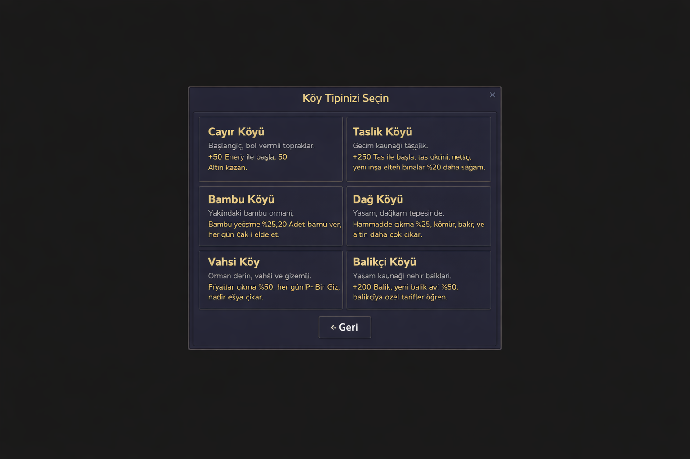
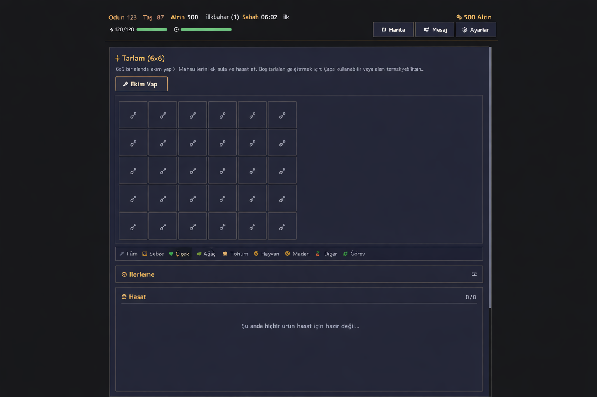

<div align="center">
  

  # gaKöy

  > Rivayet olunur ki, dağların kuytusunda dünyadan kopuk bir oba vardır — gaKöy.
  > Dört mevsim belirgindir, halkı sade ve içtendir; lakin son yıllarda gençler bir bir göçmüş, köy tenhalaşmıştır.
  > Bir gün rahmetli dedenizden bir mektup alırsınız… İçinde bir bakır anahtar ve sararmış bir tapu vardır…

  Yazı tabanlı bir kır yaşamı ve işletme oyunu. Esin kaynağı Yıldız Çiyi Vadisi’dir. Piksel üslup ve Anadolu esintili görsel dil kullanır. Tamamen istemci tarafında çalışır, sunucu gerekmez.


## Oyunun Özellikleri

**Karakter Yaratımı** — Adını yaz, cinsiyetini seç; 6 ayrı yurt farklı bereket sunar (dere balıkçılığı, kamışlık toplama, dağ madenciliği gibi). Köylüler, seçtiğin kimliğe göre sana farklı hitap eder.

**Mevsim Döngüsü** — Baharda sür, yazda ek, güzde biç, kışta sakla. Her mevsim 28 gündür. Gün akışı 06:00’dan ertesi gün 02:00’ye dek sürer. Altı çeşit hava vardır (açık, yağmur, fırtına, kar, sert yel, yeşil yağmur).

**Çiftlik Yönetimi** — 38 çeşit ürün yetiştir; 4×4’lük tarladan 8×8’lik düzene geç. 3 tür sulama düzeneği, 6 tür gübre, dört mevsim çalışan sera ve 28 günde meyve veren 8 çeşit ağaç seni bekler.

**Hayvancılık** — Kümes (tavuk, ördek, tavşan, kaz, bıldırcın, güvercin, kara tavuk, tavus kuşu) ve ağıl (inek, koyun, keçi, manda, yak, alpaka, geyik, devekuşu, deve, sığın, eşek) ile toplam 19 hayvan türü bulunur. Barınaklar 3 aşamada geliştirilir.

**Beceri Gelişimi** — Tarım, toplama, balıkçılık ve madencilik olmak üzere dört ana beceri vardır. 5. ve 10. seviyede uzmanlık yolu seçilir.

**Köy Yaşamı** — 34 köylü vardır; bunların 12’siyle evlenilebilir. Hediye ver, sohbet et, gönül olaylarını aç, ev kur, eşinin yardımıyla toprağı bereketlendir. Ayrıca 6 gizli kutlu varlık bulunur: Ejder Ruhu, Şeftali Perisi, Ay Tavşanı, Tilki Ereni, Dağ Eri ve Dönüş Kızı. Her birinin ayrı keşif zinciri, gönül bağı ve ödülü vardır.

**Balıkçılık** — 6 büyük av bölgesi bulunur (dere, gölet, ırmak, yeraltı suyu, çağlayan, bataklık) ve 60 tür balık yakalanabilir. Gerçek zamanlı mini oyunda misinayı gergin tutup iğnenin yüksekliğini ayarlarsın; ölçü dolunca avı çekersin. Yem, şamandıra, yengeç kapanı ve yağmurlu günde altın arama da vardır.

**Balık Göleti** — Balık göleti kur, yavru bırak, her gün yan ürün elde et, çoğalt ve üret.

**Maden Serüveni** — Yun Gizli Maden Ocağı 120 kattır (yüzey, kırağı, lav, billur, gölge, dipyar). Her 20 katta bir baş düşmanla sıra tabanlı savaş yapılır. Bitirince İskelet Ocağı açılır.

**Kum Denizi** — Madenin ötesinde daha ileri seviye bir serüven bölgesi vardır; daha nadir kaynaklar ve daha güçlü düşmanlar burada bulunur.

**Aşçılık** — 113 tarif vardır. Pişirdiğin yemekler can, direnç ve günlük güçlendirme sağlar.

**İşleme ve Üretim** — 21 tür işleme düzeneği bulunur (şaraplık, küp, yağlık, ocak, dokuma tezgâhı, çay düzeneği, ilaç taşı ve daha niceleri). 150’den fazla işleme tarifi vardır.

**Sandık Sistemi** — 5 tür sandık vardır (ahşap, bakır, demir, altın, boşluk). Eşyaları sınıflandırarak saklayabilirsin. Boşluk sandığı uzaktan erişim sunar; ham madde ve mamul sandığı olarak ayarlanıp atölyelerin giriş çıkışını otomatikleştirir.

**Tohum Yetiştirme** — Tohum ocağı yeni yetiştirme tohumları verir. Melezleme ile yeni türler doğar. 10 kuşağa yayılan 400 melez tarifi bulunur.

**Lonca** — 21 tür av hedefi vardır. Canavar avladıkça ün kazanır, yeni ödüller açarsın.

**Müze Koleksiyonu** — Madenler, kalıntılar ve kutlu eşyalar bağışlanır; takım tamamlandığında ödüller açılır.

**Donanım Sistemi** — Silahlar, başlıklar, ayakkabılar ve yüzükler vardır; takım etkileri ek güç verir.

**Görevler ve Başarılar** — 5 bölümden oluşan 50 ana hikâye görevi, günlük işler (teslimat, balıkçılık, madencilik, toplama), 20 topluluk görev paketi ve tüm oynanışı kapsayan 109 başarı bulunur.

**Ezgi Düzeni** — Tone.js ile gerçek zamanlı ses kurulur; beş sesli Anadolu ezgisi havası taşır. 19 arka plan ezgisi ve 80’den fazla ses etkisi vardır. Hava ve gün vakti, sesin rengini ve ritmini değiştirir.

## Oyun Görselleri





## Hızlı Başlangıç

```bash
# Bağımlılıkları kur
pnpm install

# Geliştirme sunucusunu başlat
pnpm dev

# Tür denetimi + üretim derlemesi
pnpm build

# Derlemeyi önizle
pnpm preview

# Electron masaüstü sürümünü derle
pnpm build:electron

# Yöntem 3: Yerelde imaj derle
docker build -t taoyuan .
docker run -d -p 8080:80 taoyuan
http://localhost:8080 adresine giderek oyunu başlatabilirsin.
Teknoloji Yığını
Teknoloji
Sürüm
Kullanım Alanı
Vue 3
3.5
Birleşik API + <script setup>
TypeScript
5.9
Sıkı tür denetimi
Vite
7
Derleme ve geliştirme sunucusu
Pinia
3
Durum yönetimi (26 store)
TailwindCSS
3
Atomik biçim + CSS değişkenli tema
Vue Router
5
İstemci yönlendirmesi (23 oyun paneli)
Tone.js
15
Ezgi ve ses üretimi
Electron
39
Masaüstü paketleme
lucide-vue-next
0.563
Simge takımı
VueUse
14
Birleşik yardımcı işlevler
CryptoJS
4
Kayıt AES şifreleme

Proje Yapısı
src/
├── views/              # Sayfa düzeyi bileşenler
│   ├── MainMenu.vue    # Ana menü (yeni oyun, kayıt yönetimi, içe-dışa aktarma)
│   ├── GameLayout.vue  # Oyun ana yerleşimi (durum çubuğu + yan çubuk + günlük + pencere)
│   └── game/           # 23 oyun paneli
│       ├── FarmView.vue        # Çiftlik
│       ├── AnimalView.vue      # Hayvancılık
│       ├── HomeView.vue        # Yurt ve depo
│       ├── ShopView.vue        # Dükkân
│       ├── NpcView.vue         # Köylü ilişkileri
│       ├── FishingView.vue     # Balıkçılık
│       ├── FishPondView.vue    # Balık göleti
│       ├── MiningView.vue      # Maden ocağı
│       ├── HanhaiView.vue      # Kum Denizi
│       ├── CookingView.vue     # Aşçılık
│       ├── ProcessingView.vue  # Atölye işleme
│       ├── BreedingView.vue    # Tohum yetiştirme
│       ├── MuseumView.vue      # Müze
│       ├── GuildView.vue       # Lonca
│       ├── InventoryView.vue   # Çanta
│       └── ...                 # Daha başka paneller
├── components/game/    # 20 alt bileşen (mini oyun, konuşma kutusu, durum çubuğu vb.)
├── stores/             # 26 Pinia durum ambarı
├── composables/        # Yeniden kullanılabilir mantık (gezinme, gün sonu, günlük, ses, diyalog vb.)
├── data/               # 40 oyun veri bölümü (ürün, eşya, NPC, balık, tarif vb.)
├── types/              # TypeScript tür tanımları
├── router/             # Vue Router yönlendirme ayarları
├── assets/             # Durağan kaynaklar (zpix piksel yazısı, logo)
├── app.css             # Genel biçim ve Tailwind teması
├── App.vue             # Kök bileşen
└── main.ts             # Uygulama girişi

Oyun Sistemleri Özeti
Sistem
Açıklama
Zaman
Yıl → mevsim (bahar, yaz, güz, kış) → gün (28 gün/mevsim) → vakit (06:00–ertesi gün 02:00)
Direnç
Başlangıçta 120; tüm işler direnç tüketir; özel yemeklerle üst sınır 180’e çıkar
Çiftlik
38 ürün, 4×4 → 8×8 tarla, 3 sulama düzeneği + 6 gübre, sera ile dört mevsim ekim
Hayvancılık
19 hayvan türü (8 kümes + 11 ağıl), 3 aşamalı barınak yükseltmesi
Balık Göleti
Yavru bırak, üret, yan ürün al, çoğalt
Tohum Yetiştirme
Tohum ocağı ile yeni tohumlar, yüksek nitelikli türler, 400 melez tarifi
Nitelik
Sıradan / iyi / seçkin / üstün; satış değeri ve hediye etkisini değiştirir
Çanta
20–36 göz, göz başı 99 yığın sınırı, araç çubuğu ayrıdır
Depo
Ahşap / bakır / demir / altın / boşluk sandıkları; boşluk sandığı uzaktan erişim sağlar
Araçlar
Suluk / çapa / kazma / olta; 3 aşamalı yükseltme ile direnç tüketimi azalır
Donanım
Silah, başlık, ayakkabı, yüzük; takım etkileri vardır
Dükkân
Mevsime göre ürün değişir; çantadaki eşyalar satılabilir; nitelik işaretleri görünür
NPC
34 köylü (12 evlenilebilir) + 6 gizli kutlu varlık; gönül bağı, olaylar, şenlikler
Maden
Yun Gizli Maden Ocağı 120 kat + İskelet Ocağı + Kum Denizi; sıra tabanlı savaş, baş düşman
Lonca
21 av hedefi; düşman kestikçe ün artar ve ödüller açılır
Müze
Maden, kalıntı ve kutlu eşyalar bağışlanır; takım tamamlanınca ödül açılır
Görev
5 bölüm 50 ana görev + günlük işler + 20 topluluk paketi + 109 başarı
Kayıt
3 kayıt yuvası (localStorage + AES), günlük otomatik kayıt, içe-dışa aktarma, WebDAV eşitleme
Müzik ve Ses
Tone.js ile ezgi üretimi; 19 arka plan ezgisi + 80’den fazla ses; hava ve vakte göre değişim
Tasarım Ölçüleri
Renkler: Geleneksel tonlar (koyu zemin #1a1a1a, altın vurgu #c8a45c, kızıl uyarı #c34043, kamış yeşili başarı #5a9e6f)
Yazı: zpix piksel yazısı, yazı yumuşatma kapalı
Arayüz: Düz ve sert kenarlı düğmeler, 1px ince çerçeve, en çok 2px köşe yuvarlama, 4px katlı boşluk sistemi
Uyarlama: Mobilde alt gezinme, masaüstünde yan çubuk; kırılma noktası 768px
